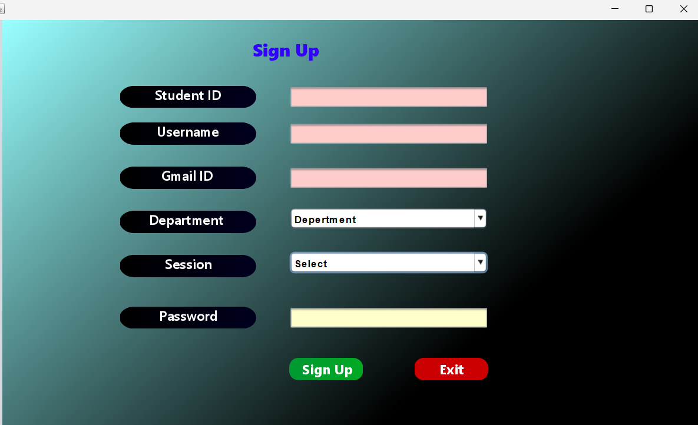
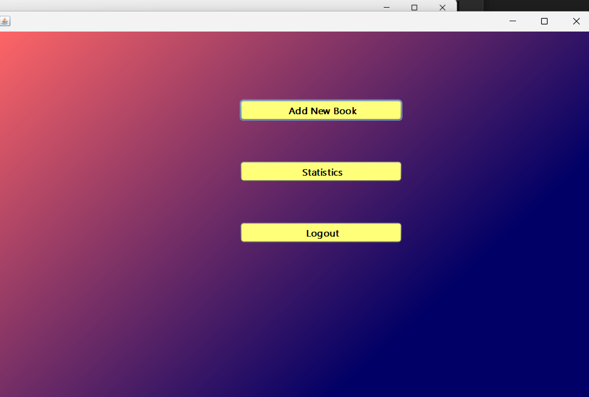
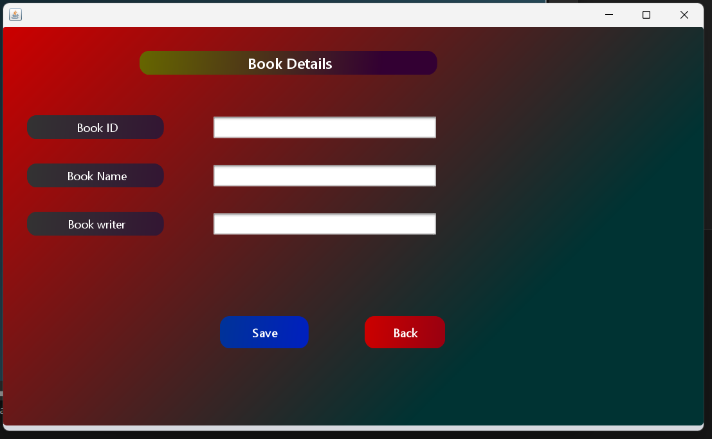
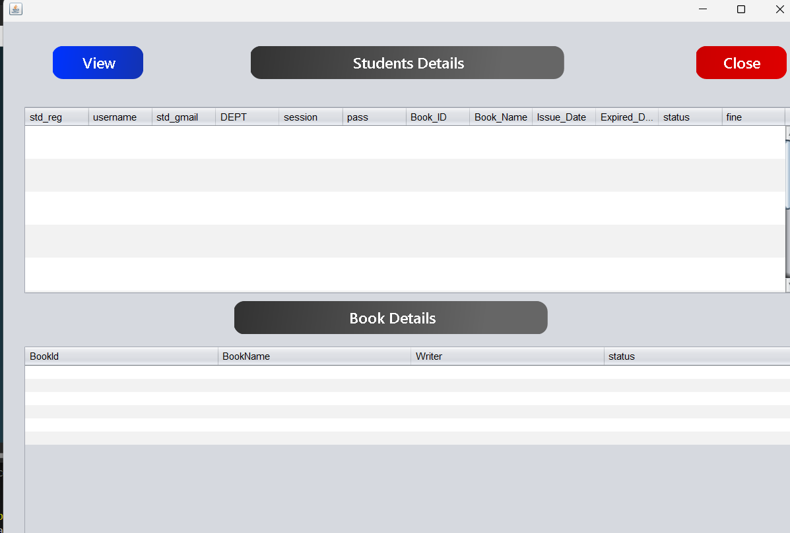

# 📚 Digital Library Management System

A Java Swing-based desktop application for managing a digital library. This system supports student signups, secure login, book management, issue/return functionality, and administrative control via a modern GUI (built with k33ptoo components).

---

## ⚙️ Technologies Used

- Java (Swing for GUI)
- MySQL (Database)
- JDBC (Java Database Connectivity)
- k33ptoo Library (for enhanced UI components)

---

## 🚀 Features

- 👤 Student and Admin Login
- 📝 Student Sign-up with form validation
- 📚 Book CRUD operations (Add, Update, Delete)
- 📊 Dashboard with real-time stats
- 📌 View and manage books/students
- 🔐 Secure authentication with database verification

---

## 🖼️ UI Screenshots & Functional Overview
### 1. 🏠 Home Page

- 📂 Here the categories of the library are shown.
- 👤 Admin or student can login from here.

### 2. 🔐 Login Page

  - 👤 Users enter username and password.
  - ✅ Validates against MySQL `student` tables.
  - ❌ Error messages displayed for incorrect credentials.

### 3. 🧑‍🎓 Student Sign-Up

### Form fields:
- 🆔 Student ID  
- 👤 Name  
- 📧 Email  
- 🏫 Department  
- 📅 Session  
- 🔒 Password  

📝 Validates each field for correct data entry  
📧 Sends confirmation or error messages after registration
 
### 3. 🧾 Admin Dashboard (`adminDashboad.png`)

  ### 🧾 Admin Dashboard Overview

  The Admin Dashboard provides a centralized interface for managing library operations efficiently.

  #### Key Sections & Actions

  - 📕 **Add New Books**  
    Quickly add new book entries to the library database.

  - 📚 **Total Books**  
    View the total number of books available in the library.

  - 🧑‍🎓 **Total Students**  
    Monitor the total registered students.

  - 📊 **Statistics**  
    Track issued and returned books with real-time stats.

 
### 4. 📕 Add New Book

This section allows admin to add new books to the library database through a structured form.

**Form Fields:**
- 🆔 Book ID
- 📖 Book Name
- ✍️ Author Name

**Features:**
- Validates input for each field
- Displays confirmation or error messages after submission
- Updates the library inventory in real-time
- Accessible only to admin users
### 5. 📊 Library Data Overview

This section presents comprehensive statistics and tabular summaries for both books and students, enabling efficient management and quick insights.

#### 📚 Book & Student Data Table
- View all books or students in a sortable, searchable table.
- Each row displays key details for easy reference.

#### 👤 Student Details
- Student ID
- Name
- Email
- Book issue/return status

#### 📖 Book Details
- Book ID
- Title
- Author
- Current status (Available/Issued)

#### 🕒 Issue & Return History
- Issue Date
- Return Date

Admins can quickly access and analyze library usage, track inventory, and monitor student activity from this centralized dashboard.
---

## 🗃️ Database Schema (Sample)

Tables:
- `admin(id, username, password)`
- `students(id, name, email, phone, password)`
- `books(id, title, author, genre, quantity)`
- `issued_books(id, student_id, book_id, issue_date, return_date)`

---

## 🔌 How to Run the Project

1. Install Java (JDK 8 or higher) and MySQL.
2. Clone this repo.
3. Import the project into your IDE (NetBeans/IntelliJ/Eclipse).
4. Update your MySQL username & password in DBConnection.java.
5. Create the necessary tables in your database using the schema.
6. Run the LoginPage.java to start the application.

---

  <strong style="font-size:4em;">Thank You</strong>

